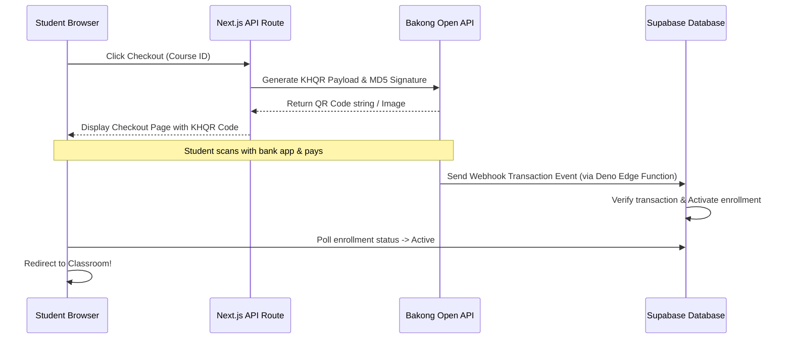

# ArchViz Academy Future Roadmap & Implementation Plan

This implementation plan details the next stages of development for the ArchViz portfolio and LMS platform. You can use this document as a reference to resume work on subsequent sessions.

***

## 📅 Phase 1: Bakong KHQR Payments Gateway Integration (Crucial Next Step)

Currently, course access is bypassed for testing. To launch publicly, we need to integrate the Cambodian Bakong KHQR checkout flow to automatically unlock courses upon payment.



### 1. Database Additions

We need to track course pricing and checkouts securely:

```SQL
-- Add price column to courses table (so admins can change prices dynamically in the future)
ALTER TABLE public.courses 
ADD COLUMN IF NOT EXISTS price NUMERIC(10, 2) NOT NULL DEFAULT 49.99;

CREATE TABLE IF NOT EXISTS public.checkout_sessions (
    session_id UUID PRIMARY KEY DEFAULT gen_random_uuid(),
    student_id UUID NOT NULL REFERENCES public.profiles(id),
    course_id UUID NOT NULL REFERENCES public.courses(course_id),
    amount NUMERIC(10, 2) NOT NULL,
    currency TEXT NOT NULL DEFAULT 'USD',
    qr_payload TEXT,
    md5_signature TEXT,
    status TEXT NOT NULL CHECK (status IN ('pending', 'completed', 'expired')),
    created_at TIMESTAMPTZ DEFAULT now()
);

-- Register payments securely
CREATE TABLE IF NOT EXISTS public.payments (
    payment_id UUID PRIMARY KEY DEFAULT gen_random_uuid(),
    student_id UUID NOT NULL REFERENCES public.profiles(id),
    course_id UUID NOT NULL REFERENCES public.courses(course_id),
    transaction_reference TEXT UNIQUE NOT NULL, -- Bakong transaction hash
    amount_paid NUMERIC(10, 2) NOT NULL,
    paid_at TIMESTAMPTZ DEFAULT now()
);
```

### 2. Next.js Checkout Generator

Create a dynamic checkout generator API route: `pages/api/checkout/session.ts`

* **Hash Compilation:** Generate MD5 HMAC hash with Bakong credentials.
* **Payload Building:** Compile EMVCo-compatible QR payloads containing merchant name, account ID, and USD transaction details.
* **Save Session:** Write session details to `checkout_sessions` table.

### 3. Deno Webhook Handler (Supabase Edge Function)

Create a secure Supabase Edge Function to verify payment callback events: `supabase/functions/bakong-webhook/index.ts`

* **Signature Verification:** Authenticate signature sent in Bakong headers.
* **Transaction Matching:** Check if `transaction_reference` is valid.
* **Auto-Unlock:** Insert `active` enrollment row in `course_enrollments` table for the matching student and course.

***

## 🎓 Phase 2: Student Certification System

Reward students upon 100% video progress completion.

### 1. Certificate Database Schema

```SQL
CREATE TABLE IF NOT EXISTS public.certificates (
    certificate_id UUID PRIMARY KEY DEFAULT gen_random_uuid(),
    student_id UUID NOT NULL REFERENCES public.profiles(id) ON DELETE CASCADE,
    course_id UUID NOT NULL REFERENCES public.courses(course_id) ON DELETE CASCADE,
    certificate_number TEXT UNIQUE NOT NULL, -- e.g., AVA-2026-XXXX
    issued_at TIMESTAMPTZ DEFAULT now()
);
```

### 2. Auto-Generation Logic

* **Trigger:** When a student finishes the last video (hitting 90% playtime) and all lessons in a course are marked `is_completed = true`.
* **Database Action:** Insert a row in `certificates` with a unique certificate reference number.
* **Frontend UI:** Render a downloadable PDF certificate layout directly in the browser (using standard HTML Canvas or `html2pdf.js`).

***

## 📈 Phase 3: Instructor Analytics Panel

Expose insights in the Admin portal so instructors can trace learning patterns.

* **Submissions Statistics:** Track average grading, revision rate, and active students.
* **Video Heatmaps:** See which video lessons have the highest drop-off rate (calculated using average watch progress time).
* **CRM Logs:** Drill down into individual student profiles to view their homework logs, average scores, and watch hours.

***

## 🚀 How to Resume This Project Later:

1. Verify the database state:
   ```Shell
   npx -y tsx scratch/check_progress.ts
   ```
2. Review user permissions:
   ```SQL
   SELECT id, email, role FROM auth.users JOIN public.profiles USING(id);
   ```
3. Proceed directly with the **Bakong KHQR Payment Gateway** checkout API routes (Phase 1).

