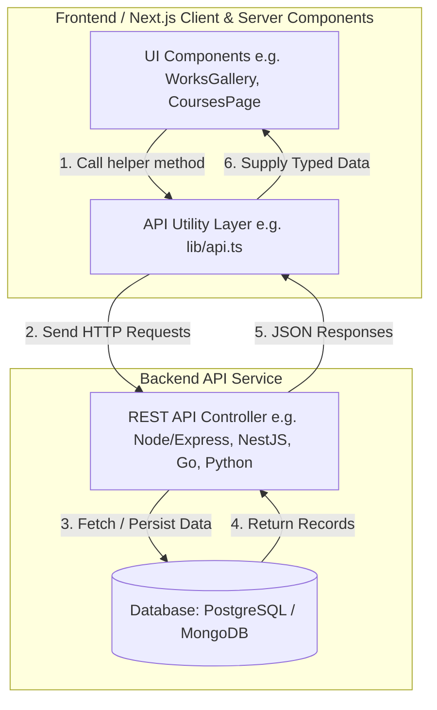

# Backend Integration Documentation

Welcome to the Backend Integration Documentation for the **Archviz Portfolio Website**. This guide is designed to help backend developers understand the frontend directory structure, data formats, and API contracts necessary to implement a matching database and API service.

Currently, the frontend is a **Next.js 16 (App Router)** application built with TypeScript, React 19, TailwindCSS, and Framer Motion. It runs using local mock/static data stored in the `lib/` directory. Your goal as a backend developer is to replace this static data with real-time dynamic API queries.

---

## 🗺️ Documentation Directory

Use the following links to navigate the detailed sections of this integration blueprint:

1. 📂 **[Folder Structure & Key Files](./folder_structure.md)**
   - Explains the layout of the Next.js frontend project.
   - Highlights the files that need refactoring to connect to the backend APIs.
2. 🗄️ **[Data Models & DB Schema](./data_models.md)**
   - Displays the TypeScript interfaces used for core entities (`Project`, `Course`, `Testimonial`).
   - Outlines recommended database schemas (SQL/NoSQL) matching these contracts.
3. 🔌 **[API Endpoints Specification](./api_endpoints.md)**
   - Defines the REST API endpoints required by the frontend.
   - Provides request/response payload examples for each endpoint.
4. 🚀 **[Frontend Integration Guide](./integration_guide.md)**
   - A step-by-step developer guide on refactoring the frontend.
   - Includes implementation patterns for env variables, service layers, and fetching methods.

---

## ⚙️ High-Level Architecture Flow

This diagram illustrates how the frontend components will query the backend API service instead of importing local data files:

---

## 🛠️ Tech Stack & Key Frontend Dependencies

To ensure seamless integration, keep these frontend details in mind:
- **Framework:** Next.js 16 (using the new `app` directory router).
- **Language:** TypeScript (strictly typed interfaces in [`types.ts`](../lib/types.ts)).
- **Styles & UI:** TailwindCSS, Lucide React, and Radix UI primitives.
- **Dynamic Content:** Images/videos are currently resolved through `lib/utils.ts` mapping to a CDN/public storage or local path.
