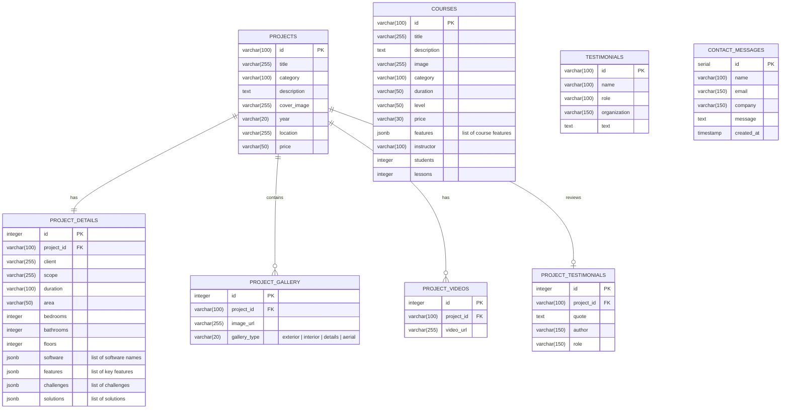

# Data Models & Database Schema Recommendations

This document outlines the core frontend TypeScript interfaces and proposes corresponding database schemas for both **Relational (SQL)** and **Document-oriented (NoSQL)** databases.

---

## 📐 Frontend TypeScript Interfaces

These interfaces are defined in the frontend (primarily [`lib/types.ts`](../lib/types.ts), [`lib/projects-data.ts`](../lib/projects-data.ts), and [`lib/courses-data.ts`](../lib/courses-data.ts)). Your backend responses must conform to these structures to prevent TypeScript compilation errors on the client.

### 1. Project Interface
Used for presenting architectural visualization portfolios.
```typescript
export interface Project {
  id: string              // Unique identifier (slug/slugified-name or UUID)
  title: string           // Name of the project
  category: string        // e.g. "Residential", "Commercial", "Institutional", etc.
  description: string     // Long text project description
  image: string           // Cover/main image URL path
  year: string            // Year completed (stored as string in frontend)
  location: string        // Location details (e.g. "Phnom Penh, Cambodia")
  price: string           // Project cost details (e.g. "$25,000")
  details: {
    client: string        // Name of the client
    scope: string         // e.g. "Exterior & Interior Visualization"
    software: string[]    // list of tools (e.g. ["D5 Render", "Sketchup", "Photoshop"])
    duration: string      // Timeline (e.g. "4 weeks")
    area?: string         // Optional property (e.g. "15,000 sq ft")
    bedrooms?: number     // Optional number of bedrooms
    bathrooms?: number    // Optional number of bathrooms
    floors?: number       // Optional number of floors
    features?: string[]   // List of key features
    challenges?: string[] // List of difficulties faced during construction/rendering
    solutions?: string[]  // How they were resolved
  }
  images: string[]        // List of all image URLs in the portfolio
  gallery: {
    exterior: string[]    // Sublist of exterior image URLs
    interior: string[]    // Sublist of interior image URLs
    details: string[]     // Sublist of close-up render URLs
    aerial?: string[]     // Optional sublist of aerial/drone view URLs
  }
  videos?: string[]       // Optional list of animation video links (YouTube/Vimeo or file path)
  testimonials?: {        // Optional embedded testimonial
    quote: string         // Review body
    author: string        // Reviewer name
    role: string          // Reviewer job title (e.g., "Principal Architect")
  }
}
```

### 2. Course Interface
Used to list courses on the "Learn with Us" page.
```typescript
export interface Course {
  id: string              // Unique identifier (slug or UUID)
  title: string           // Course name
  description: string     // Details of what is covered
  image: string           // Course card cover image URL
  category: string        // Category (e.g., "Rendering", "Post-Production")
  duration: string        // Course length (e.g., "6 weeks")
  level: string           // Difficulty level (e.g., "Beginner to Intermediate")
  price: string           // Price text representation (e.g., "$49.99")
  features: string[]      // Top highlights (e.g., ["Real-time rendering workflow"])
  instructor: string      // Instructor name (e.g. "Bun Sambath")
  students: number        // Enrolled student count (e.g. 1500)
  lessons: number         // Count of lessons (e.g. 42)
}
```

### 3. Testimonial Interface
Used for reviews displayed on the main page.
```typescript
export interface Testimonial {
  id: string              // Unique identifier
  name: string            // Reviewer name
  role: string            // Reviewer title
  organization: string    // Organization / Company
  text: string            // Testimonial review quote
}
```

### 4. Contact Message Model
Form data sent by frontend users.
```typescript
export interface ContactMessage {
  name: string            // Sender name (required)
  email: string           // Sender email address (required)
  company?: string        // Sender organization name (optional)
  message: string         // Project details/message content (required)
}
```

---

## 🗄️ Database Schema Design Recommendations

Here are structural recommendations depending on the database chosen for the backend.

### Option A: Relational Database (SQL - PostgreSQL/MySQL)

A relational model divides the project's nested structures (`details`, `gallery`, `testimonials`) into normalized tables or takes advantage of native `JSONB` columns (highly recommended in PostgreSQL for flexible structures like arrays and objects).

#### Database Diagram (ERD Concept)


#### SQL DDL Schema Definition Example (PostgreSQL)
```sql
-- Create Enum for Gallery categories
CREATE TYPE gallery_type_enum AS ENUM ('exterior', 'interior', 'details', 'aerial');

-- Projects table
CREATE TABLE projects (
    id VARCHAR(100) PRIMARY KEY,
    title VARCHAR(255) NOT NULL,
    category VARCHAR(100) NOT NULL,
    description TEXT NOT NULL,
    cover_image VARCHAR(255) NOT NULL,
    year VARCHAR(20) NOT NULL,
    location VARCHAR(255) NOT NULL,
    price VARCHAR(50) NOT NULL,
    created_at TIMESTAMP DEFAULT CURRENT_TIMESTAMP
);

-- Nested Details (1-to-1 with Project)
CREATE TABLE project_details (
    id SERIAL PRIMARY KEY,
    project_id VARCHAR(100) REFERENCES projects(id) ON DELETE CASCADE UNIQUE,
    client VARCHAR(255) NOT NULL,
    scope VARCHAR(255) NOT NULL,
    duration VARCHAR(100) NOT NULL,
    area VARCHAR(50),
    bedrooms INTEGER,
    bathrooms INTEGER,
    floors INTEGER,
    software JSONB NOT NULL,    -- Array of strings
    features JSONB,            -- Array of strings
    challenges JSONB,          -- Array of strings
    solutions JSONB            -- Array of strings
);

-- Gallery Images (1-to-many relationship)
CREATE TABLE project_gallery (
    id SERIAL PRIMARY KEY,
    project_id VARCHAR(100) REFERENCES projects(id) ON DELETE CASCADE,
    image_url VARCHAR(255) NOT NULL,
    gallery_type gallery_type_enum NOT NULL
);

-- Videos (1-to-many relationship)
CREATE TABLE project_videos (
    id SERIAL PRIMARY KEY,
    project_id VARCHAR(100) REFERENCES projects(id) ON DELETE CASCADE,
    video_url VARCHAR(255) NOT NULL
);

-- Embedded Testimonial (1-to-1/1-to-many optional relationship)
CREATE TABLE project_testimonials (
    id SERIAL PRIMARY KEY,
    project_id VARCHAR(100) REFERENCES projects(id) ON DELETE CASCADE UNIQUE,
    quote TEXT NOT NULL,
    author VARCHAR(150) NOT NULL,
    role VARCHAR(150) NOT NULL
);

-- Independent Courses
CREATE TABLE courses (
    id VARCHAR(100) PRIMARY KEY,
    title VARCHAR(255) NOT NULL,
    description TEXT NOT NULL,
    image VARCHAR(255) NOT NULL,
    category VARCHAR(100) NOT NULL,
    duration VARCHAR(50) NOT NULL,
    level VARCHAR(50) NOT NULL,
    price VARCHAR(30) NOT NULL,
    features JSONB NOT NULL,    -- Array of strings
    instructor VARCHAR(100) NOT NULL,
    students INTEGER DEFAULT 0,
    lessons INTEGER DEFAULT 0,
    created_at TIMESTAMP DEFAULT CURRENT_TIMESTAMP
);

-- Independent Testimonials
CREATE TABLE testimonials (
    id VARCHAR(100) PRIMARY KEY,
    name VARCHAR(100) NOT NULL,
    role VARCHAR(100) NOT NULL,
    organization VARCHAR(150) NOT NULL,
    text TEXT NOT NULL,
    created_at TIMESTAMP DEFAULT CURRENT_TIMESTAMP
);

-- Contact Inquiries
CREATE TABLE contact_messages (
    id SERIAL PRIMARY KEY,
    name VARCHAR(100) NOT NULL,
    email VARCHAR(150) NOT NULL,
    company VARCHAR(150),
    message TEXT NOT NULL,
    created_at TIMESTAMP DEFAULT CURRENT_TIMESTAMP
);
```

---

### Option B: NoSQL Database (MongoDB Documents)

Since frontend models have deeply nested fields, MongoDB fits naturally with the existing structures without needing relational joins.

#### Mongoose Schemas (Node.js/Express Backend)

```javascript
const mongoose = require('mongoose');

// Project Schema
const ProjectSchema = new mongoose.Schema({
  _id: { type: String, required: true }, // Map to project.id slug
  title: { type: String, required: true },
  category: { type: String, required: true },
  description: { type: String, required: true },
  image: { type: String, required: true }, // Cover image path
  year: { type: String, required: true },
  location: { type: String, required: true },
  price: { type: String, required: true },
  details: {
    client: { type: String, required: true },
    scope: { type: String, required: true },
    software: [{ type: String }],
    duration: { type: String, required: true },
    area: String,
    bedrooms: Number,
    bathrooms: Number,
    floors: Number,
    features: [{ type: String }],
    challenges: [{ type: String }],
    solutions: [{ type: String }]
  },
  images: [{ type: String }], // Array of image URLs
  gallery: {
    exterior: [{ type: String }],
    interior: [{ type: String }],
    details: [{ type: String }],
    aerial: [{ type: String }]
  },
  videos: [{ type: String }],
  testimonials: {
    quote: String,
    author: String,
    role: String
  }
}, { timestamps: true });

// Course Schema
const CourseSchema = new mongoose.Schema({
  _id: { type: String, required: true }, // Course slug
  title: { type: String, required: true },
  description: { type: String, required: true },
  image: { type: String, required: true },
  category: { type: String, required: true },
  duration: { type: String, required: true },
  level: { type: String, required: true },
  price: { type: String, required: true },
  features: [{ type: String }],
  instructor: { type: String, required: true },
  students: { type: Number, default: 0 },
  lessons: { type: Number, default: 0 }
}, { timestamps: true });

// Testimonial Schema
const TestimonialSchema = new mongoose.Schema({
  name: { type: String, required: true },
  role: { type: String, required: true },
  organization: { type: String, required: true },
  text: { type: String, required: true }
}, { timestamps: true });

// Contact Schema
const ContactSchema = new mongoose.Schema({
  name: { type: String, required: true },
  email: { type: String, required: true },
  company: String,
  message: { type: String, required: true }
}, { timestamps: true });

module.exports = {
  Project: mongoose.model('Project', ProjectSchema),
  Course: mongoose.model('Course', CourseSchema),
  Testimonial: mongoose.model('Testimonial', TestimonialSchema),
  Contact: mongoose.model('Contact', ContactSchema)
};
```
